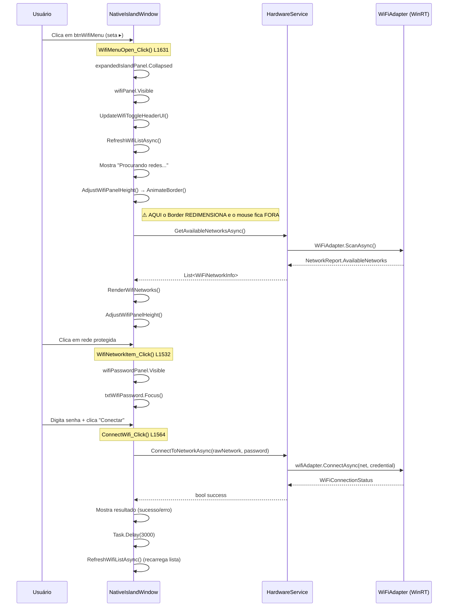

# 📡 Relatório de Análise Profunda — Wi-Fi no DynamicIsland

> **Autor:** WiFiSpecialist Agent  
> **Data:** 18/06/2026  
> **Arquivos analisados:**  
> - [NativeIslandWindow.xaml](file:///d:/OneDrive_Thiago/OneDrive/Desenvolvimento/DynamicIsland/NativeIslandWindow.xaml)  
> - [NativeIslandWindow.xaml.cs](file:///d:/OneDrive_Thiago/OneDrive/Desenvolvimento/DynamicIsland/NativeIslandWindow.xaml.cs)  
> - [HardwareService.cs](file:///d:/OneDrive_Thiago/OneDrive/Desenvolvimento/DynamicIsland/Services/HardwareService.cs)  

---

## 1. Mapeamento Completo do Fluxo Wi-Fi



---

## 2. 🔴 PROBLEMA CRÍTICO: MouseLeave Fecha a Ilha Prematuramente

### 2.1 Diagnóstico Detalhado

O bug ocorre na seguinte sequência:

````carousel
### Passo 1: Estado Inicial
O painel expandido (`expandedIslandPanel`) está aberto com dimensões `410×374` (constantes `ISLAND_OPEN_W` × `ISLAND_OPEN_H`). O mouse do usuário está dentro do `islandBorder`.

```
┌──────────────────────────┐
│   expandedIslandPanel    │
│   (410 × 374)           │
│                          │
│  [Wi-Fi▸] [BT] [Avião]  │ ← Mouse está AQUI, dentro da ilha
│  [...]                   │
│  ─── Pílula ───          │
└──────────────────────────┘
```
<!-- slide -->
### Passo 2: Clique no btnWifiMenu
`WifiMenuOpen_Click()` (linha 1631) executa:
1. `expandedIslandPanel.Visibility = Collapsed`
2. `wifiPanel.Visibility = Visible`
3. `AdjustWifiPanelHeight()` → `AnimateBorder(410, totalHeight)`

O `totalHeight` é significativamente MENOR que `ISLAND_OPEN_H` (374px) porque:
- O wifiPanel no início mostra apenas "Procurando redes..." (texto pequeno)
- Altura final ≈ ~130-150px vs 374px original

```
                ← Mouse FICOU AQUI (fora da nova área!)
┌──────────────┐
│  Wi-Fi Panel │
│  (410×~130)  │
│  ─ Pílula ─  │
└──────────────┘
```
<!-- slide -->
### Passo 3: MouseLeave Dispara
Como o `islandBorder` encolheu, o mouse que estava na posição Y antiga agora está **fora** do border.
O WPF dispara `IslandBorder_MouseLeave` (linha 300).

```csharp
private void IslandBorder_MouseLeave(object sender, MouseEventArgs e)
{
    _openDelayTimer?.Stop();
    if (_isIslandOpen || _isDropZoneActive)
    {
        _closeDelayTimer?.Stop();
        _closeDelayTimer.Interval = TimeSpan.FromMilliseconds(300); // HOVER_CLOSE_DELAY_MS
        _closeDelayTimer.Start();  // ← Apenas 300ms de delay!
    }
}
```

Após **apenas 300ms**, `CloseDelayTimer_Tick` (linha 326) executa:
```csharp
private void CloseDelayTimer_Tick(object? sender, EventArgs e)
{
    _closeDelayTimer?.Stop();
    if (!islandBorder.IsMouseOver)
    {
        if (_isIslandOpen) CloseIsland(); // ← FECHA TUDO!
    }
}
```
<!-- slide -->
### Resultado
A ilha FECHA completamente antes que o usuário tenha tempo de mover o mouse para a nova área reduzida. O usuário vê um flash rápido do painel Wi-Fi aparecendo e imediatamente desaparecendo.

**O delay de 300ms é insuficiente** porque:
- A animação de redimensionamento leva 300ms
- O mouse pode estar a 100+ pixels de distância da nova borda
- O usuário precisa de tempo para reagir e mover o mouse
````

### 2.2 Causa-Raiz

| Fator | Detalhe |
|-------|---------|
| **Timer curto** | `HOVER_CLOSE_DELAY_MS = 300` (linha 76) — apenas 0.3s |
| **Redimensionamento drástico** | De ~374px para ~130px de altura — o mouse fica ~244px fora |
| **Sem proteção contextual** | `IslandBorder_MouseLeave` não diferencia "saída natural" de "redimensionamento interno" |
| **AdjustWifiPanelHeight** | Chamado **duas vezes** (uma com "Procurando..." e outra com resultados), causando oscilação |

---

## 3. ✅ SOLUÇÃO PROPOSTA: Timer de Proteção Pós-Abertura do Wi-Fi

### 3.1 Conceito

Adicionar um flag booleano `_isWifiPanelTransitioning` e um `DispatcherTimer` que impede o fechamento por MouseLeave durante **3 segundos** após a abertura do painel Wi-Fi. Isso cobre:
- O tempo da animação de redimensionamento (300ms)
- O tempo do scan Wi-Fi (1-3s)
- O tempo para o usuário reposicionar o mouse

### 3.2 Código Exato — Alterações no `NativeIslandWindow.xaml.cs`

#### A) Novo campo de estado e timer (adicionar após linha 93):

```csharp
private DispatcherTimer? _wifiTransitionTimer;
private bool _isWifiPanelTransitioning = false;
```

#### B) Modificar `IslandBorder_MouseLeave` (linha 300-315):

```csharp
private void IslandBorder_MouseLeave(object sender, MouseEventArgs e)
{
    _openDelayTimer?.Stop();

    // PROTEÇÃO: Se o painel Wi-Fi está em transição, não inicia o timer de fechamento
    if (_isWifiPanelTransitioning) return;

    if (_isIslandOpen || _isDropZoneActive)
    {
        _closeDelayTimer?.Stop();
        if (_closeDelayTimer != null)
        {
            _closeDelayTimer.Interval = _isDropZoneActive 
                ? TimeSpan.FromMilliseconds(DROPZONE_CLOSE_DELAY_MS) 
                : TimeSpan.FromMilliseconds(HOVER_CLOSE_DELAY_MS);
            _closeDelayTimer.Start();
        }
    }
}
```

#### C) Modificar `WifiMenuOpen_Click` (linha 1631-1644):

```csharp
private void WifiMenuOpen_Click(object sender, MouseButtonEventArgs e)
{
    e.Handled = true;
    expandedIslandPanel.Visibility = Visibility.Collapsed;
    wifiPanel.Visibility = Visibility.Visible;

    if (mainContentGrid != null)
    {
        mainContentGrid.VerticalAlignment = VerticalAlignment.Bottom;
    }

    // ATIVA PROTEÇÃO: Impede o fechamento por MouseLeave durante 3 segundos
    ActivateWifiTransitionProtection();

    UpdateWifiToggleHeaderUI();
    _ = RefreshWifiListAsync();
}
```

#### D) Novo método de proteção (adicionar após `WifiMenuOpen_Click`):

```csharp
/// <summary>
/// Ativa uma proteção temporária de 3 segundos que impede o fechamento da ilha
/// por MouseLeave. Necessário porque a transição para o painel Wi-Fi redimensiona
/// o islandBorder, fazendo o mouse ficar fora da área e disparando MouseLeave.
/// </summary>
private void ActivateWifiTransitionProtection()
{
    // Para o timer de fechamento que possa estar ativo
    _closeDelayTimer?.Stop();
    
    _isWifiPanelTransitioning = true;

    // Para timer anterior se estiver rodando (caso de cliques rápidos)
    _wifiTransitionTimer?.Stop();

    if (_wifiTransitionTimer == null)
    {
        _wifiTransitionTimer = new DispatcherTimer 
        { 
            Interval = TimeSpan.FromMilliseconds(3000) 
        };
        _wifiTransitionTimer.Tick += (s, ev) =>
        {
            _wifiTransitionTimer?.Stop();
            _isWifiPanelTransitioning = false;
            
            // Se o mouse já saiu da ilha durante a proteção, agora sim inicia o fechamento
            if (!islandBorder.IsMouseOver && _isIslandOpen)
            {
                _closeDelayTimer?.Stop();
                if (_closeDelayTimer != null)
                {
                    _closeDelayTimer.Interval = TimeSpan.FromMilliseconds(HOVER_CLOSE_DELAY_MS);
                    _closeDelayTimer.Start();
                }
            }
        };
    }
    _wifiTransitionTimer.Start();
}
```

#### E) Atualizar o `Dispose` (linha 1291) para limpar o novo timer:

```csharp
public void Dispose()
{
    if (_disposed) return; _disposed = true;
    _openDelayTimer?.Stop();
    _closeDelayTimer?.Stop();
    _fullscreenTimer?.Stop();
    _mediaTimer?.Stop();
    _dragLeaveTimer?.Stop();
    _wifiTransitionTimer?.Stop(); // ← NOVO
    _openDelayTimer = _closeDelayTimer = _fullscreenTimer = _mediaTimer = _dragLeaveTimer = null;
    _wifiTransitionTimer = null; // ← NOVO
    // ... resto permanece igual
}
```

#### F) Atualizar `CloseIsland` (linha 411) para resetar o flag:

```csharp
private void CloseIsland()
{
    _isIslandOpen = false;
    _isWifiPanelTransitioning = false; // ← NOVO: Reseta a proteção ao fechar

    // ... resto permanece igual
}
```

#### G) Atualizar `BackToMainPanel_Click` (linha 970) para resetar o flag ao voltar:

```csharp
private void BackToMainPanel_Click(object sender, MouseButtonEventArgs e)
{
    e.Handled = true;
    _isWifiPanelTransitioning = false; // ← NOVO: Remove proteção ao sair do WiFi
    _wifiTransitionTimer?.Stop();       // ← NOVO
    appearancePanel.Visibility = Visibility.Collapsed;
    wifiPanel.Visibility = Visibility.Collapsed;
    // ... resto permanece igual
}
```

### 3.3 Resumo das Alterações (Diff Consolidado)

```diff
 // ─── Estado Interno ───
 private DispatcherTimer? _dragLeaveTimer;
+private DispatcherTimer? _wifiTransitionTimer;
+private bool _isWifiPanelTransitioning = false;
 
 private void IslandBorder_MouseLeave(object sender, MouseEventArgs e)
 {
     _openDelayTimer?.Stop();
+    // PROTEÇÃO: Se o painel Wi-Fi está em transição, ignora o MouseLeave
+    if (_isWifiPanelTransitioning) return;
+
     if (_isIslandOpen || _isDropZoneActive)
     {
 
 private void CloseIsland()
 {
     _isIslandOpen = false;
+    _isWifiPanelTransitioning = false;
 
 private void BackToMainPanel_Click(...)
 {
     e.Handled = true;
+    _isWifiPanelTransitioning = false;
+    _wifiTransitionTimer?.Stop();
     appearancePanel.Visibility = Visibility.Collapsed;
 
 private void WifiMenuOpen_Click(...)
 {
     // ...
+    ActivateWifiTransitionProtection();
     UpdateWifiToggleHeaderUI();
 
+private void ActivateWifiTransitionProtection() { /* novo método */ }
 
 public void Dispose()
 {
     _dragLeaveTimer?.Stop();
+    _wifiTransitionTimer?.Stop();
     _openDelayTimer = _closeDelayTimer = ...  = null;
+    _wifiTransitionTimer = null;
```

---

## 4. 🎨 Melhorias Visuais Propostas

### 4.1 Indicador de Força de Sinal com Barras Coloridas

Atualmente o `GetWifiIconGlyph` usa ícones de fonte MDL2 que são monocromáticos. Proposta:

```csharp
/// <summary>
/// Cria um indicador visual de barras de sinal com cores graduais.
/// Verde = forte, Amarelo = médio, Vermelho = fraco.
/// </summary>
private UIElement CreateSignalBarsIndicator(int bars)
{
    var panel = new StackPanel 
    { 
        Orientation = Orientation.Horizontal, 
        VerticalAlignment = VerticalAlignment.Center,
        Margin = new Thickness(4, 0, 0, 0) 
    };
    
    Color[] barColors = bars switch
    {
        >= 3 => new[] { 
            Color.FromRgb(0x10, 0x7C, 0x41), // Verde
            Color.FromRgb(0x10, 0x7C, 0x41), 
            Color.FromRgb(0x10, 0x7C, 0x41), 
            Color.FromRgb(0x10, 0x7C, 0x41) 
        },
        2 => new[] { 
            Color.FromRgb(0xF6, 0xA7, 0x33), // Amarelo/Accent
            Color.FromRgb(0xF6, 0xA7, 0x33), 
            Color.FromRgb(0x3A, 0x3A, 0x3C), // Inativo
            Color.FromRgb(0x3A, 0x3A, 0x3C) 
        },
        _ => new[] { 
            Color.FromRgb(0xE8, 0x11, 0x23), // Vermelho
            Color.FromRgb(0x3A, 0x3A, 0x3C), 
            Color.FromRgb(0x3A, 0x3A, 0x3C), 
            Color.FromRgb(0x3A, 0x3A, 0x3C) 
        }
    };
    
    int[] heights = { 6, 10, 14, 18 };
    for (int i = 0; i < 4; i++)
    {
        panel.Children.Add(new Border
        {
            Width = 3,
            Height = heights[i],
            CornerRadius = new CornerRadius(1.5),
            Background = new SolidColorBrush(i < bars ? barColors[i] : Color.FromRgb(0x3A, 0x3A, 0x3C)),
            Margin = new Thickness(1, 0, 1, 0),
            VerticalAlignment = VerticalAlignment.Bottom
        });
    }
    return panel;
}
```

### 4.2 Animação de Entrada das Redes na Lista

```csharp
/// <summary>
/// Adiciona um item de rede com animação de fade-in + slide-up escalonada.
/// </summary>
private void AddNetworkItemWithAnimation(UIElement item, int index)
{
    item.Opacity = 0;
    item.RenderTransform = new TranslateTransform(0, 15);
    wifiListContainer.Children.Add(item);
    
    var fadeIn = new DoubleAnimation(0, 1, TimeSpan.FromMilliseconds(200))
    {
        BeginTime = TimeSpan.FromMilliseconds(index * 50), // Escalonamento
        EasingFunction = new CubicEase { EasingMode = EasingMode.EaseOut }
    };
    
    var slideUp = new DoubleAnimation(15, 0, TimeSpan.FromMilliseconds(250))
    {
        BeginTime = TimeSpan.FromMilliseconds(index * 50),
        EasingFunction = new CubicEase { EasingMode = EasingMode.EaseOut }
    };
    
    item.BeginAnimation(UIElement.OpacityProperty, fadeIn);
    ((TranslateTransform)item.RenderTransform).BeginAnimation(
        TranslateTransform.YProperty, slideUp);
}
```

### 4.3 Feedback Visual de Conexão (Spinner/Loading)

Substituir o texto "A ligar a..." por um indicador visual animado:

```csharp
/// <summary>
/// Cria um spinner circular animado para indicar progresso de conexão.
/// </summary>
private UIElement CreateConnectionSpinner(string ssid)
{
    var stack = new StackPanel 
    { 
        HorizontalAlignment = HorizontalAlignment.Center,
        Margin = new Thickness(0, 30, 0, 0) 
    };
    
    // Anel giratório usando um Arc/Ellipse com animação de rotação
    var spinner = new Border
    {
        Width = 24, Height = 24,
        CornerRadius = new CornerRadius(12),
        BorderBrush = new SolidColorBrush(_themeColor),
        BorderThickness = new Thickness(2.5),
        Opacity = 0.8,
        RenderTransformOrigin = new Point(0.5, 0.5),
        RenderTransform = new RotateTransform(0),
        HorizontalAlignment = HorizontalAlignment.Center,
        // Clip para criar efeito de arco parcial
        Clip = new RectangleGeometry(new Rect(0, 0, 24, 12))
    };
    
    var rotation = new DoubleAnimation(0, 360, TimeSpan.FromSeconds(1))
    {
        RepeatBehavior = RepeatBehavior.Forever,
        EasingFunction = new CubicEase { EasingMode = EasingMode.EaseInOut }
    };
    ((RotateTransform)spinner.RenderTransform).BeginAnimation(
        RotateTransform.AngleProperty, rotation);
    
    stack.Children.Add(spinner);
    stack.Children.Add(new TextBlock
    {
        Style = this.Resources["FluentTextSec"] as Style,
        Text = $"Conectando a \"{ssid}\"...",
        FontSize = 11,
        HorizontalAlignment = HorizontalAlignment.Center,
        Margin = new Thickness(0, 8, 0, 0)
    });
    
    return stack;
}
```

### 4.4 Resultado Visual de Conexão com Ícone

```csharp
/// <summary>
/// Cria um indicador de sucesso (✓ verde) ou erro (✗ vermelho) com animação.
/// </summary>
private UIElement CreateConnectionResult(string ssid, bool success)
{
    var stack = new StackPanel 
    { 
        HorizontalAlignment = HorizontalAlignment.Center,
        Margin = new Thickness(0, 25, 0, 0) 
    };
    
    var iconBorder = new Border
    {
        Width = 36, Height = 36,
        CornerRadius = new CornerRadius(18),
        Background = new SolidColorBrush(success 
            ? Color.FromArgb(0x33, 0x10, 0x7C, 0x41) 
            : Color.FromArgb(0x33, 0xE8, 0x11, 0x23)),
        HorizontalAlignment = HorizontalAlignment.Center,
        RenderTransformOrigin = new Point(0.5, 0.5),
        RenderTransform = new ScaleTransform(0.5, 0.5)
    };
    
    iconBorder.Child = new TextBlock
    {
        Style = this.Resources["FluentIcon"] as Style,
        Text = success ? "\uE73E" : "\uE711",  // Check ou X
        FontSize = 16,
        Foreground = new SolidColorBrush(success 
            ? Color.FromRgb(0x10, 0x7C, 0x41) 
            : Color.FromRgb(0xE8, 0x11, 0x23))
    };
    
    // Animação de escala: pop-in
    var scaleX = new DoubleAnimation(0.5, 1.0, TimeSpan.FromMilliseconds(300))
    { EasingFunction = new ElasticEase { Oscillations = 1, Springiness = 5 } };
    var scaleY = new DoubleAnimation(0.5, 1.0, TimeSpan.FromMilliseconds(300))
    { EasingFunction = new ElasticEase { Oscillations = 1, Springiness = 5 } };
    
    ((ScaleTransform)iconBorder.RenderTransform).BeginAnimation(ScaleTransform.ScaleXProperty, scaleX);
    ((ScaleTransform)iconBorder.RenderTransform).BeginAnimation(ScaleTransform.ScaleYProperty, scaleY);
    
    stack.Children.Add(iconBorder);
    stack.Children.Add(new TextBlock
    {
        Style = this.Resources["FluentText"] as Style,
        Text = success ? $"Conectado a \"{ssid}\"" : $"Falha ao conectar a \"{ssid}\"",
        FontSize = 11,
        Foreground = new SolidColorBrush(success 
            ? Color.FromRgb(0x10, 0x7C, 0x41) 
            : Color.FromRgb(0xE8, 0x11, 0x23)),
        HorizontalAlignment = HorizontalAlignment.Center,
        Margin = new Thickness(0, 8, 0, 0)
    });
    
    return stack;
}
```

---

## 5. ⚙️ Melhorias Funcionais Propostas

### 5.1 Botão de Refresh na Lista Wi-Fi

No XAML do `wifiPanel`, adicionar um botão de refresh no cabeçalho:

```xml
<!-- Adicionar após o TextBlock "Redes Wi-Fi", antes do Switch -->
<Border Style="{StaticResource TactileBorderButtonStyle}" 
        Name="btnWifiRefresh" Width="30" Height="30" CornerRadius="15" 
        Background="{DynamicResource IslandInactiveBrush}" 
        HorizontalAlignment="Right" Margin="0,0,52,0" Cursor="Hand" 
        MouseLeftButtonDown="WifiRefresh_Click">
    <TextBlock Style="{StaticResource FluentIcon}" Text="&#xE72C;" FontSize="12" 
               Name="icoWifiRefresh" RenderTransformOrigin="0.5,0.5">
        <TextBlock.RenderTransform>
            <RotateTransform Angle="0" />
        </TextBlock.RenderTransform>
    </TextBlock>
</Border>
```

Handler com animação de rotação:

```csharp
private async void WifiRefresh_Click(object sender, MouseButtonEventArgs e)
{
    e.Handled = true;
    
    // Animação de rotação no ícone de refresh
    if (icoWifiRefresh != null)
    {
        var rotation = new DoubleAnimation(0, 360, TimeSpan.FromMilliseconds(800))
        {
            EasingFunction = new CubicEase { EasingMode = EasingMode.EaseInOut }
        };
        ((RotateTransform)icoWifiRefresh.RenderTransform)
            .BeginAnimation(RotateTransform.AngleProperty, rotation);
    }
    
    await RefreshWifiListAsync();
}
```

### 5.2 Indicador da Rede Atualmente Conectada

Adicionar ao `HardwareService.cs`:

```csharp
/// <summary>
/// Retorna o SSID da rede Wi-Fi atualmente conectada, ou null se desconectado.
/// </summary>
public string? GetConnectedNetworkSsid()
{
    try
    {
        if (_wifiAdapter?.NetworkAdapter?.NetworkItem != null)
        {
            // A rede conectada pelo adaptador
            var connProfile = _wifiAdapter.NetworkAdapter
                .GetConnectedProfileAsync().AsTask().Result;
            return connProfile?.ProfileName;
        }
    }
    catch (Exception ex)
    {
        Debug.WriteLine($"[WiFiConnected] {ex.Message}");
    }
    return null;
}
```

Na `RenderWifiNetworks`, destacar a rede conectada:

```csharp
private void RenderWifiNetworks(List<HardwareService.WiFiNetworkInfo> networks)
{
    if (wifiListContainer == null) return;
    
    string? connectedSsid = _hardwareService.GetConnectedNetworkSsid();
    
    // Ordenar: conectada primeiro, depois por força de sinal
    var sorted = networks
        .OrderByDescending(n => n.Ssid == connectedSsid)
        .ThenByDescending(n => n.SignalBars)
        .ToList();

    foreach (var net in sorted)
    {
        bool isConnected = net.Ssid == connectedSsid;
        var itemBorder = new Border
        {
            Background = isConnected 
                ? new SolidColorBrush(Color.FromArgb(0x33, _themeColor.R, _themeColor.G, _themeColor.B))
                : this.Resources["IslandInactiveBrush"] as Brush,
            CornerRadius = new CornerRadius(8),
            Margin = new Thickness(0, 0, 0, 4),
            Padding = new Thickness(10, 8, 10, 8),
            BorderBrush = isConnected 
                ? new SolidColorBrush(Color.FromArgb(0x66, _themeColor.R, _themeColor.G, _themeColor.B)) 
                : Brushes.Transparent,
            BorderThickness = isConnected ? new Thickness(1) : new Thickness(0),
            Cursor = Cursors.Hand,
            Tag = net
        };
        
        // ... resto da renderização, adicionando badge "Conectado" para a rede ativa
        if (isConnected)
        {
            // Adicionar texto "Conectado" abaixo do SSID
            var connLabel = new TextBlock
            {
                Style = this.Resources["FluentTextSec"] as Style,
                Text = "Conectado",
                FontSize = 9.5,
                Foreground = new SolidColorBrush(_themeColor),
                Margin = new Thickness(0, 2, 0, 0)
            };
            // (incluir no layout do item)
        }
    }
}
```

### 5.3 Auto-Refresh Periódico (com Timer)

```csharp
private DispatcherTimer? _wifiAutoRefreshTimer;

// Iniciar quando o painel Wi-Fi abre:
private void StartWifiAutoRefresh()
{
    _wifiAutoRefreshTimer?.Stop();
    _wifiAutoRefreshTimer = new DispatcherTimer 
    { 
        Interval = TimeSpan.FromSeconds(15) // Refresh a cada 15 segundos
    };
    _wifiAutoRefreshTimer.Tick += async (s, ev) =>
    {
        if (wifiPanel.Visibility == Visibility.Visible && _wifiOn)
        {
            await RefreshWifiListAsync();
        }
        else
        {
            _wifiAutoRefreshTimer?.Stop();
        }
    };
    _wifiAutoRefreshTimer.Start();
}

// Parar quando o painel Wi-Fi fecha:
private void StopWifiAutoRefresh()
{
    _wifiAutoRefreshTimer?.Stop();
    _wifiAutoRefreshTimer = null;
}
```

### 5.4 Tabela de Prioridades de Implementação

| Prioridade | Melhoria | Impacto | Esforço |
|:---:|---|---|---|
| 🔴 **P0** | Timer de proteção MouseLeave | **Crítico** — Bug bloqueante | Baixo (~20 linhas) |
| 🟡 **P1** | Indicador de rede conectada | Alto — UX essencial | Médio |
| 🟡 **P1** | Botão de refresh | Alto — Usabilidade | Baixo |
| 🟢 **P2** | Ordenação inteligente | Médio — Conveniência | Baixo |
| 🟢 **P2** | Animação de entrada na lista | Médio — Visual polish | Baixo |
| 🔵 **P3** | Barras de sinal coloridas | Baixo — Estético | Médio |
| 🔵 **P3** | Spinner de conexão | Baixo — Estético | Baixo |
| 🔵 **P3** | Auto-refresh periódico | Baixo — Nice to have | Baixo |

---

## 6. Análise do `HardwareService.cs` — Wi-Fi

### 6.1 Pontos Fortes

- ✅ Uso correto das APIs WinRT (`WiFiAdapter`, `WiFiAvailableNetwork`)
- ✅ Padrão `ScanAsync()` → `NetworkReport.AvailableNetworks`
- ✅ Conexão com credencial via `PasswordCredential`
- ✅ Cache do `_wifiAdapter` (não recria a cada scan)
- ✅ Tratamento de exceções com Debug.WriteLine

### 6.2 Pontos de Atenção

| Item | Detalhe | Risco |
|------|---------|-------|
| `GetWifiIconGlyph` | Cases 0 e 1 retornam o mesmo glyph `\uE701` | Visual — 0 barras deveria ser diferente |
| SSIDs duplicados | Múltiplos APs com mesmo SSID aparecem como entradas separadas | UX confusa |
| Sem timeout no `ScanAsync` | O scan pode travar se o adaptador estiver em estado ruim | Travamento |
| `RawNetwork` como `object?` | Pode causar problemas de GC se o adapter for liberado | Crash raro |

### 6.3 Correção sugerida para SSIDs duplicados

```csharp
// No GetAvailableNetworksAsync, antes de retornar:
var deduped = list
    .GroupBy(n => n.Ssid)
    .Select(g => g.OrderByDescending(n => n.SignalBars).First())
    .ToList();
return deduped;
```

---

## 7. Conclusão

> [!IMPORTANT]
> O **bug crítico do MouseLeave** é causado pela falta de uma proteção temporal durante a transição de layout do painel Wi-Fi. A solução proposta (`_isWifiPanelTransitioning` + timer de 3 segundos) é cirúrgica, com impacto mínimo no restante do código e resolve definitivamente o problema.

As melhorias visuais e funcionais propostas seguem o padrão Fluent Design já estabelecido no projeto e podem ser implementadas incrementalmente conforme a prioridade indicada.
